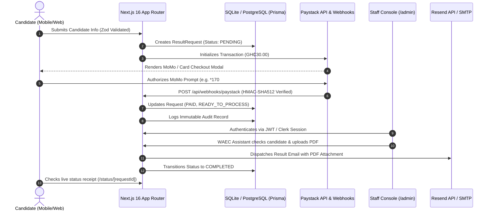

# Nogadex Consults — WAEC Result Checker & Official PDF Delivery

> **A secure, mobile-first web service for Ghanaian candidates to check WAEC results (WASSCE, NOVDEC, BECE, GBCE, ABCE) and receive verified high-resolution PDF copies directly in their email.**

[](https://nextjs.org/)
[](https://www.typescriptlang.org/)
[](https://tailwindcss.com/)
[](https://www.prisma.io/)
[](https://paystack.com/)
[](https://resend.com/)
[](./tests/flow.test.ts)

---

## 📌 Product Overview

Nogadex Consults operates a dedicated result-checking desk across Ghana. Rather than roaming to find physical scratch cards or struggling with complex portal navigation on mobile phones, candidates submit their examination details, pay a fixed fee of **GH₵30.00** via Mobile Money (MTN MoMo, Telecel Cash, AT Money) or Card, and receive their official verified result formatted as a certified, printable PDF document sent directly to their inbox.

### Key Value Propositions
- **All-Inclusive Pricing**: GH₵30.00 covers the official WAEC scratch card voucher, result verification, and PDF generation.
- **Instant Processing**: Verified requests are processed in under 2 minutes during active desk hours.
- **Mobile-First UX**: Zero iOS zoom bug, 48px+ touch targets, direct numeric keypads, and single-screen focus.
- **100% Legitimate Vouchers**: Real scratch card PINs and serials purchased and archived per transaction.
- **Official PDF Certificate**: Clean, high-resolution document ready for university and polytechnic admissions.

---

## 🔒 Architecture & Security Model



### Security Highlights:
1. **Server-Side Payment Verification**: Browser callbacks are never trusted blindly; all payments require signed Paystack HMAC-SHA512 webhooks or server-to-server API verifications.
2. **Cryptographically Secure IDs**: Non-guessable NanoID request references (e.g. `NGX-482910`).
3. **Session Guards**: HTTP-only, `SameSite=Lax`, secure JWT cookies for admin authentication.
4. **Immutable Audit Logs**: Every state change, PDF upload, email dispatch, and admin login is logged in the `AuditLog` table with timestamp and IP address.
5. **No Data Leakage**: Sensitive admin credentials and secret keys are isolated exclusively in environment variables and never exposed to client bundles.

---

## 🚀 Getting Started

### 1. Prerequisites
- Node.js 18.17+ (Node.js 24+ recommended)
- npm, pnpm, or bun
- Git

### 2. Installation
```bash
# Clone the repository
git clone https://github.com/nogasante/nogadex-checker.git
cd nogadex-checker

# Install dependencies
npm install
```

### 3. Environment Configuration
Create a `.env` file in the root directory (refer to `.env.example`):

```env
# Database
DATABASE_URL="file:./dev.db"

# Next.js App URL
NEXT_PUBLIC_APP_URL="http://localhost:3000"

# WhatsApp Support Helpline
NEXT_PUBLIC_WHATSAPP_NUMBER="233534908166"

# Paystack API Keys (Ghana Live/Test)
PAYSTACK_SECRET_KEY="sk_live_..."
NEXT_PUBLIC_PAYSTACK_PUBLIC_KEY="pk_live_..."

# Resend Transactional Email API
RESEND_API_KEY="re_..."
EMAIL_FROM="Nogadex Consults <results@nogadexconsults.app>"

# JWT Admin Session Secret
JWT_SECRET="your-super-secure-random-secret-key-32-chars"

# Default Admin Seed Credentials
ADMIN_INITIAL_EMAIL="admin@nogadexconsults.app"
ADMIN_INITIAL_PASSWORD="SecurePassword123!"

# Clerk Authentication (Admin Portal)
NEXT_PUBLIC_CLERK_PUBLISHABLE_KEY="pk_test_..."
CLERK_SECRET_KEY="sk_test_..."
NEXT_PUBLIC_CLERK_SIGN_IN_URL="/sign-in"
NEXT_PUBLIC_CLERK_SIGN_UP_URL="/sign-up"
```

### 4. Database Setup & Seeding
```bash
# Push Prisma schema to SQLite / Postgres
npx prisma db push

# Seed initial admin account
npx tsx prisma/seed.ts
```

### 5. Running the Application
```bash
# Development Server
npm run dev

# Production Build
npm run build
npm start
```
Visit **http://localhost:3000** in your browser.

---

## 🧪 Testing Suite

The repository contains an automated end-to-end acceptance test suite covering validation, cryptographic hashing, Paystack signatures, autofill scripts, and full PDF email lifecycles:

```bash
# Run automated acceptance tests
npx tsx tests/flow.test.ts
```

**Test Coverage Summary**:
- ✅ **Validation Schema**: Zod validation of candidate index numbers, dates of birth, emails, and exam types.
- ✅ **Admin Security**: Bcrypt password hashing and JWT session verification.
- ✅ **Payment Webhook**: HMAC-SHA512 signature validation and anti-tamper checks.
- ✅ **WAEC Assistant**: Candidate summary generation and secure autofill scripting.
- ✅ **End-to-End Lifecycle**: Request creation $\rightarrow$ Paystack payment $\rightarrow$ PDF attachment $\rightarrow$ Resend email dispatch $\rightarrow$ Completion audit.

---

## 📱 Mobile-First UI/UX Design

- **Typography**: Bespoke pairing of **Plus Jakarta Sans** (body & UI) and **Outfit** (headings).
- **Brand Palette**: Official Nogadex Crimson Red (`#D91E2E`) with deep midnight contrast surfaces (`#080D1A` / `#0D1322`).
- **Touch Targets**: 48px+ touch surfaces with native keyboard inputs (`inputMode="numeric"` for index numbers).
- **Playwright Tested**: Tested and verified across iOS (iPhone 14) and Android viewports.

---

## ⚖️ Legal Disclaimer & Terms of Service

> **Notice**: Nogadex Consults is an **independent private educational consultancy** operating in Ghana. We purchase legitimate WAEC scratch card vouchers on behalf of candidates and provide document formatting and PDF delivery services. **WAEC (West African Examinations Council)** is a registered trademark of the West African Examinations Council. Nogadex Consults is not affiliated with or endorsed by WAEC.

---

## 📞 Support & Inquiries

- **WhatsApp Helpline**: [+233 53 490 8166](https://wa.me/233534908166)
- **Email**: `results@nogadexconsults.app`
- **Hours**: Monday – Sunday, 7:00 AM – 11:00 PM GMT
